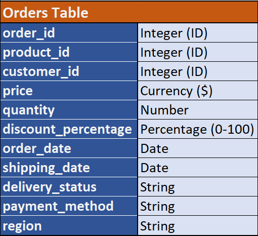
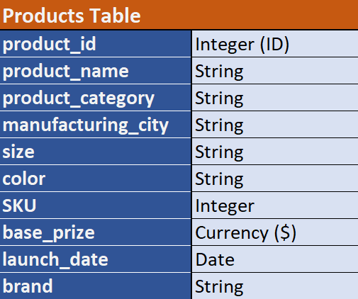

# 📈 Sales Profitability & Margin Optimization Analysis

## 📖 Project Overview
This project provides a comprehensive analysis of transactional sales data to evaluate profitability drivers, pricing efficiency, and operational performance. By integrating order transactions with product metadata, we uncover key insights into margin contribution, discount effectiveness, and regional performance. The goal is to move beyond simple revenue metrics and focus on **true margin efficiency** to guide strategic decision-making.

## 🚀 Executive Summary
*For the busy stakeholder:*
This analysis identifies a **critical profit concentration** risk, where the top five products generate **~74% of total profit**, while three underperforming products erode margins by **10%**. Our findings suggest that current discounting strategies are ineffective, reducing profitability by **~23%** without driving significant volume. Regionally, the **South** market leads in efficiency, and **UPI** has emerged as the dominant payment preference (52%). Immediate opportunities exist to optimize the product mix and restructure discount policies to reclaim lost margins.

## ❓ Business Problem
In a high-volume retail environment, top-line revenue often masks underlying inefficiencies. The primary objective of this analysis is to:
- **Identify Profitability Drivers:** Distinguish between high-revenue and high-margin products.
- **Assess Discount Efficiency:** Determine if price reductions are generating sufficient volume uplift to justify margin erosion.
- **Optimize Operations:** Uncover performance variances across geographical regions and payment methods.

## 📊 Data Sources & Methodology
The analysis is based on a relational dataset consisting of two core tables:

### Database Schema

1.  **Order Transaction Table:** 5,000 granular transaction entries containing sales, quantity, discounts, and customer details.
2.  **Product Master Table:** 20 unique product entries with cost and category metadata.

**Methodology:**
*   **Data Cleaning:** Handled missing values, standardized categorical variables, and validated data types.
You can check the sql code of data cleaning here:- 

*   **Data Modeling:** Merged transaction and product tables to calculate net profit, profit margins, and cost of goods sold (COGS).
*   **Exploratory Data Analysis (EDA):** Performed univariate and multivariate analysis to detect outliers and distribution patterns.   
You can check the sql code of EDA here :- 

*   **Feature Engineering:** derived metrics such as `Net Margin %`, `Discount Impact Ratio`, and `Profit Contribution`.

## 🛠️ Tech Stack
This project leverages the following tools and libraries for data processing and visualization:

*    - Data storage and preliminary analysis.
*    - Data extraction and management.

## 🗝️ Key Findings & Insights

> *Detailed visualizations and code are available in the project notebooks.*

### 1. The Pareto of Profitability
Profit is **highly concentrated**. The top five products are responsible for **~74% of total profit** despite representing only **~33% of revenue**. Conversely, three specific products are "silent bleeders," contributing to a **10% negative profit** impact.

### 2. The Discount Trap
Discounts are currently misaligned with consumer behavior. Our analysis shows that discounting strategies reduce the average profit per product by **~23%** but fail to produce a statistically meaningful uplift in sales volume. This suggests a need to pivot from blanket discounts to targeted loyalty incentives.

### 3. Regional & Operational Efficiency
*   **South Region Dominance:** The South region leads in profitability per order, reinforcing that margin efficiency—not just aggregate demand—is the primary growth lever.
*   **Digital Adoption:** **UPI** accounts for **~52%** of all organic transactions, signaling a shift towards digital-first payment behaviors that can be leveraged for checkout optimization.

---
*Author: [Rudra pratap Singh]*
